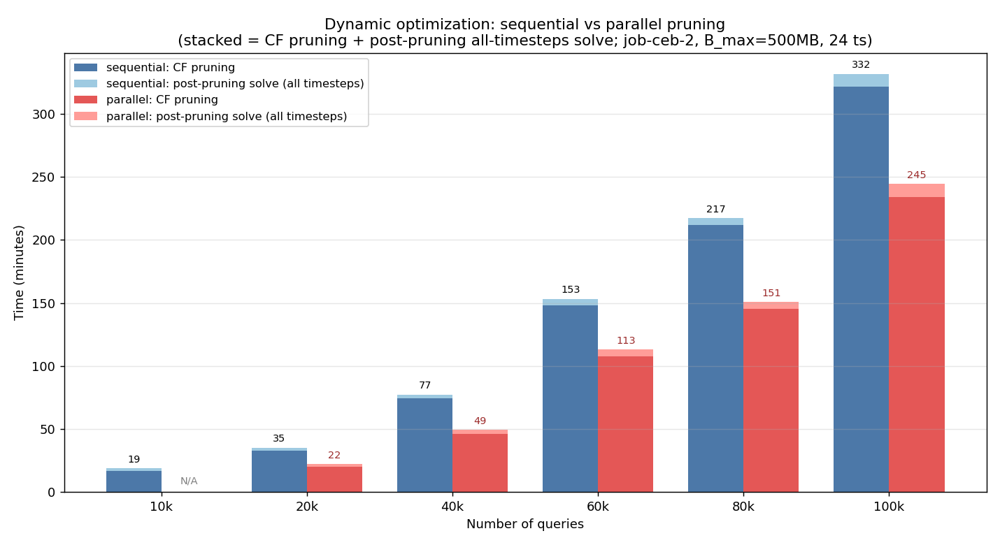
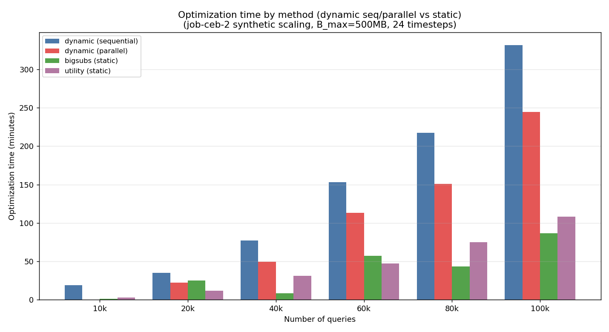

# 直列 vs 並列プルーニングの最適化時間比較（＋static）

作成日: 2026-06-25
対象: `job-ceb-2` を擬似K倍タイル複製した合成クエリセット（最適化のみ・ベンチマークなし）
共通条件: `B_max=500MB`, 頻度 `_24_mono`（24タイムステップ）, Gurobi(アカデミック), 64コア/2TiB RAM

結果ファイル（`time_dependent_output/job-ceb-2-q{N}/`）：
- dynamic 直列：`td_mv_optimization_result_24_mono_seq.json`
- dynamic 並列（共有メモリ版CFプルーニング）：`td_mv_optimization_result_24_mono.json`
- static bigsubs：`static_bigsubs_optimization_result_24_mono.json`
- static utility：`static_mv_optimization_result_24_mono.json`

dynamic は要望どおり **「CFプルーニング時間」と「プルーニング後の全時刻最適化（ILP求解）時間」に分けて**示す。

## グラフ①：dynamic 直列 vs 並列（プルーニング＋求解の積み上げ）



濃色＝CFプルーニング、淡色（上の薄い帯）＝プルーニング後の全時刻ILP求解。各棒上の数値は合計（分）。q10000 の並列は未実行（N/A）。

## グラフ②：手法別の最適化時間（dynamic直列/並列 ＋ static）



## 結果テーブル（分）

| クエリ数 | 直列 プルーニング | 直列 求解 | 並列 プルーニング | 並列 求解 | プルーニング高速化 | bigsubs | utility |
|---:|---:|---:|---:|---:|---:|---:|---:|
| 10,000 | 16.6 | 2.3 | (N/A) | (N/A) | – | 1.5 | 3.1 |
| 20,000 | 33.0 | 2.1 | 19.8 | 2.2 | **1.66×** | 25.2 | 11.6 |
| 40,000 | 74.3 | 3.0 | 46.2 | 3.2 | **1.61×** | 8.4 | 31.4 |
| 60,000 | 148.4 | 5.0 | 107.6 | 5.4 | **1.38×** | 57.5 | 47.2 |
| 80,000 | 211.8 | 5.4 | 145.3 | 5.6 | **1.46×** | 43.3 | 75.0 |
| 100,000 | 321.9 | 10.1 | 234.1 | 10.4 | **1.37×** | 86.7 | 108.1 |

## 考察

- **並列化でCFプルーニングが 1.37〜1.66倍高速化**（例：100kで 322分→234分、約88分短縮）。x2 では効果が誤差だったが、**大規模ではWSTの中間階層に十分な兄弟ノードが生まれ並列が効く**。
- **プルーニング後の全時刻ILP求解時間は直列・並列でほぼ同一**（例：100k 10.1分 vs 10.4分）。これは**両者の有望MV集合が同一**で、最終ILPが同じ問題を解いている裏付け（共有メモリ化は結果を変えない）。差は機械ノイズ程度。
- **総時間はプルーニングが支配的**（求解はどの規模でも数分〜10分、プルーニングは数十〜300分超）。よって高速化の主戦場はプルーニング。
- **static との比較**：bigsubs はランダム反復で非単調・ばらつき大、utility は単調増加で中間的。dynamic（並列）は依然として最も重いが、これは24時点＋マイグレーションを扱う本質的に難しい問題を解いているため（static は単一平均スナップショットの近似）。目的関数の土俵が違うため時間のみの比較。

## 補足
- 並列プルーニングは共有メモリ(CSR)方式で per-task の pickle 転送ゼロ・物理1コピー。レベル単位BFSで親子境界制約は直列と同一 → **有望MV集合は直列と完全一致**（先の x2 検証で 2920＝2920 を確認済み）。
- q10000 の並列は未実行のため N/A。必要なら追加実行可能。

## 再現
```bash
.venv/bin/python progress/scaling_pruning/plot_seq_vs_parallel.py
```
