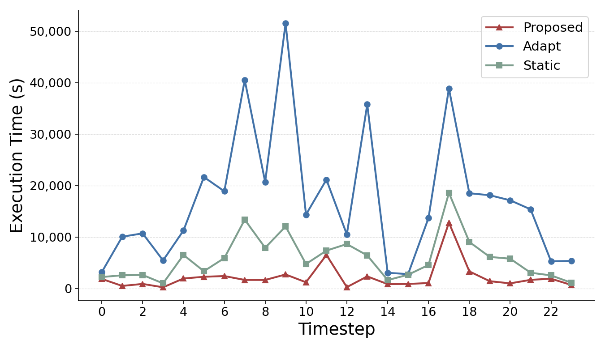
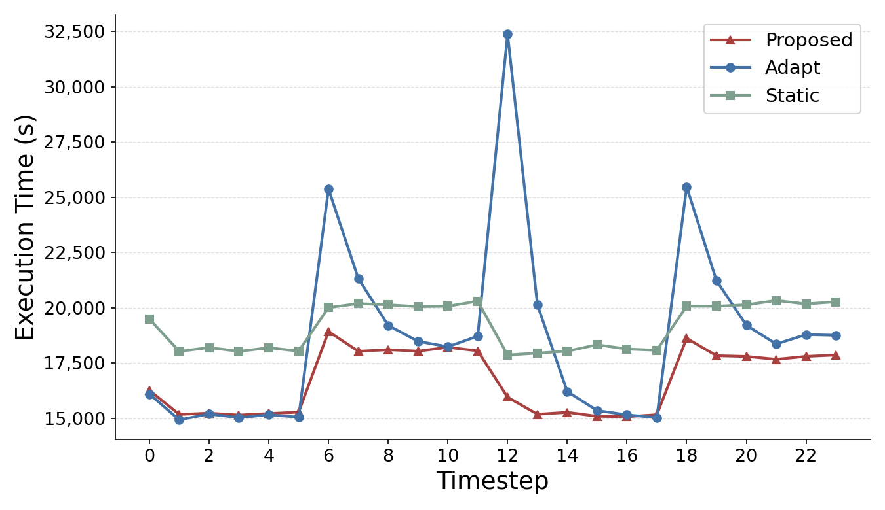
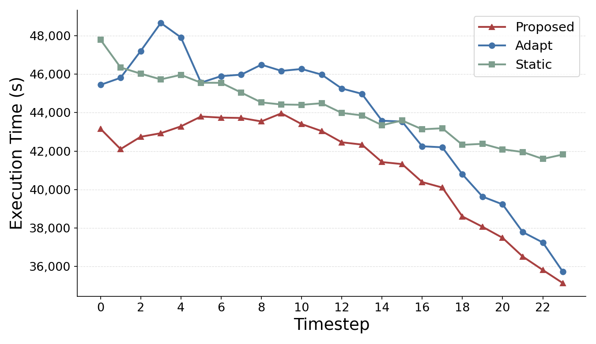
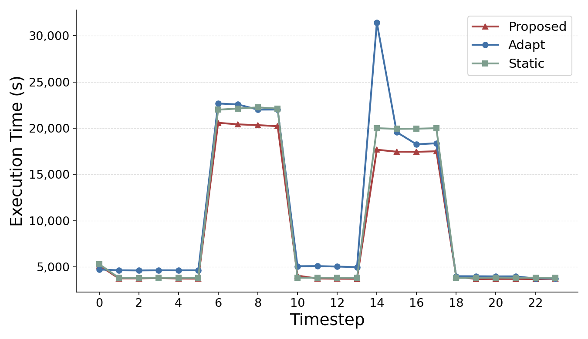

# タイムステップ別実行時間（500M スケール, 4 ワークロード）

作成日: 2026-07-13

## 概要

500M スケールにおける**各タイムステップの実行時間**を 3 手法で比較した。縦軸は各時刻の
`total_time`（= その時刻のクエリワークロード実行時間 + マイグレーション時間）。

対象ワークロードは以下の 4 種類:

| ワークロード | 説明 | データフォルダ / freq |
|---|---|---|
| **Redbench** | Redbench 合成ワークロード | `ex2_500M_ok` / `2h_x2_50x` |
| **24_2_10** | JOB-CEB-2（頻度パターン 2_10） | `job-ceb-2/result_500M_ok` / `24_2_10` |
| **24_mono** | JOB-CEB-2（単調変化 monotonic） | `job-ceb-2/result_500M_ok` / `24_mono` |
| **24_peak** | JOB-CEB-2（ピーク型 peak） | `job-ceb-2/result_500M_ok` / `24_peak` |

| 手法 | 説明 |
|---|---|
| **Proposed** | 提案手法（時間依存 dynamic） |
| **Adapt** | 過去のワークロードのみ参照する適応手法（adaptive w4） |
| **Static** | 静的最適化（bigsubs ではない） |

**初期 MV 生成コストの扱い**: Static は各タイムステップにマイグレーションを持たず、代わりに
**初期 MV 生成コスト**（`initial_mv_creation_time`）を実験開始時に一度だけ支払う。
本レポートでは、この初期 MV 生成時間を **Static のタイムステップ 0 に加算**して図示する
（Proposed・Adapt は各タイムステップ内で構築/マイグレーションコストを支払うため変更なし）。
Redbench のみ、比較用に「初期 MV 生成を含めない版」も併記する。

## Redbench（ex2_500M）

### 初期 MV 生成時間を含めない（各タイムステップの実行のみ）

Static のタイムステップ 0 はクエリ実行時間のみ（初期 MV 生成は含めない）。

PDF: [ex1_1/timestep_time_ex2_500M.pdf](ex1_1/timestep_time_ex2_500M.pdf)
スクリプト: [ex1_1/plot_timestep_time_ex2.py](ex1_1/plot_timestep_time_ex2.py)

### 初期 MV 生成時間を Static のタイムステップ 0 に含める

PDF: [ex1_1/timestep_time_ex2_500M_static_init.pdf](ex1_1/timestep_time_ex2_500M_static_init.pdf)
スクリプト: [ex1_1/plot_timestep_time_ex2_static_init.py](ex1_1/plot_timestep_time_ex2_static_init.py)

## 他の 3 ワークロード（初期 MV 生成時間を Static のタイムステップ 0 に含む）

生成スクリプト（3 図共通）: [ex1_1/plot_timestep_time_static_init.py](ex1_1/plot_timestep_time_static_init.py)

### 24_2_10

PDF: [ex1_1/timestep_time_24_2_10_static_init.pdf](ex1_1/timestep_time_24_2_10_static_init.pdf)

### 24_mono

PDF: [ex1_1/timestep_time_24_mono_static_init.pdf](ex1_1/timestep_time_24_mono_static_init.pdf)

### 24_peak

PDF: [ex1_1/timestep_time_24_peak_static_init.pdf](ex1_1/timestep_time_24_peak_static_init.pdf)

## Static タイムステップ 0 の内訳（単位: 秒）

| ワークロード | ts0（初期MVなし） | + 初期MV生成 | ts0（初期MV込み） |
|---|---:|---:|---:|
| Redbench | 2,226.77 | 2,039.87 | 4,266.65 |
| 24_2_10 | 18,070.16 | 1,424.14 | 19,494.30 |
| 24_mono | 46,351.46 | 1,444.49 | 47,795.95 |
| 24_peak | 3,853.31 | 1,443.49 | 5,296.79 |

## 考察

- **Adapt は変動に追従できずピークが突出する。** 各ワークロードのピーク時刻で Adapt が最大となり、
  過去参照のみでは急変に対応できない（Adapt のピーク: Redbench 約 51,579 秒、24_mono 約 48,666 秒、
  24_2_10 約 32,385 秒、24_peak 約 31,429 秒）。
- **Proposed は全区間で最小に近い実行時間を維持。** 将来ワークロードを見越した時間依存 MV 配置により、
  ピーク時刻でも他手法を下回る。
- **初期 MV 生成コストの影響は限定的。** Static のタイムステップ 0 は初期 MV 生成時間の分だけ
  上昇する（例: Redbench 2,227→4,267、24_2_10 18,070→19,494 秒）が、いずれも一度きりのコストであり、
  24 タイムステップ全体・ピーク時刻の大小関係は変わらない。
- 4 ワークロードを通じて、手法間の傾向・優劣の結論は一致する（Proposed < Static < Adapt のピーク）。

## 備考

- 縦軸 `total_time` = マイグレーション時間 + クエリワークロード実行時間。Static はマイグレーションを
  持たないため実質クエリ実行時間で、本図では **ts0 に初期 MV 生成時間を加算**（Redbench の「含めない版」を除く）。
- Redbench は noise なし（noise0）の結果。
- 配色・マーカーは `time_dependent_output/ex2_500M_ok/plot_noise.py` に統一
  （Proposed=赤 `^` `#A84040` / Adapt=青 `o` `#4272A8` / Static=緑 `s` `#7E9E8E`）。
- y 軸はデータに合わせて自動スケール（上限・下限フィット）。
- 初期 MV 生成時間の加算は描画時のみで、元の結果 JSON は変更していない。
