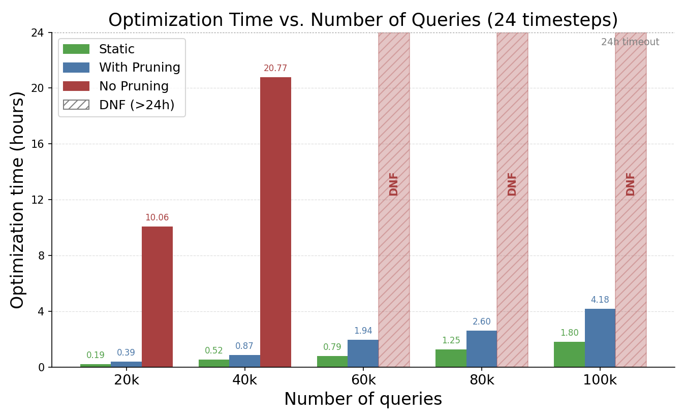

# 最適化時間のスケーラビリティ評価（クエリ数を増加させた場合）

作成日: 2026-07-13

## 概要

タイムステップ数を 24 に固定し、クエリ数を 20k〜100k（`job-ceb-2-q{N}`）まで増加させたときの
**最適化フェーズ（Phase 6）の実行時間**を、以下 3 手法で比較した。

| 手法 | 説明 | 使用フィールド | 結果ファイル |
|---|---|---|---|
| **Static** | 静的（utility）最適化。bigsubs ではない。 | `execution_time` | `static_mv_optimization_result_24_mono.json` |
| **With Pruning** | 提案手法（時間依存 dynamic）＋ CF Pruning（並列） | `phase_time_sec` | `td_mv_optimization_result_24_mono_wp.json` |
| **No Pruning** | 提案手法だが CF Pruning なし（全候補を ILP に投入） | `phase_time_sec` | `td_mv_optimization_result_24_mono.json` |

**No Pruning は 1 実行あたり 24 時間でタイムアウト**させており、24 時間以内に解けなかった規模は
結果ファイルが生成されないため **DNF (Did Not Finish, > 24h)** として図示した。

## 結果

PDF 版: [scaling_pruning/opt_time_query_scaling.pdf](scaling_pruning/opt_time_query_scaling.pdf)
生成スクリプト: [scaling_pruning/plot_opt_time_query_scaling.py](scaling_pruning/plot_opt_time_query_scaling.py)

### 数値（単位: 時間）

| クエリ数 | Static | With Pruning | No Pruning |
|---:|---:|---:|---:|
| 20k | 0.19 | 0.39 | 10.06 |
| 40k | 0.52 | 0.87 | 20.77 |
| 60k | 0.79 | 1.94 | **DNF (>24h)** |
| 80k | 1.25 | 2.60 | **DNF (>24h)** |
| 100k | 1.80 | 4.18 | **DNF (>24h)** |

## 考察

- **プルーニングの効果は決定的。** クエリ 20k で No Pruning は 10.06 時間を要するのに対し、
  With Pruning はわずか 0.39 時間（**約 26 倍**の高速化）。40k では No Pruning が 20.77 時間まで
  膨れ上がるが、With Pruning は 0.87 時間（**約 24 倍**）に収まる。
- **No Pruning は 60k 以上でスケールしない。** 60k・80k・100k はいずれも 24 時間で解けず DNF。
  一度 40k で 20.77 時間に達しているため、より大規模で 24 時間を超えるのは妥当であり、
  以降の実験は打ち切った。
- **提案手法（With Pruning）は 100k までスケール。** 最大規模の 100k でも 4.18 時間で完了し、
  クエリ数に対して緩やかな増加に留まる。これは CF Pruning によって ILP に投入する候補 MV を
  大幅に削減（例: 20k で 178,884 → 8,473、約 21 分の 1）できていることによる。
- **Static は最速だが別軸の比較。** Static は単一時点の最適化のため最適化時間自体は最小だが、
  ワークロード変動に追従できない（本評価は最適化時間のみを対象とし、
  クエリ実行時間・マイグレーション時間は含まない点に注意）。

## まとめ

CF Pruning は提案手法をクエリ数 100k 規模まで実用時間（数時間）で解けるようにする
**不可欠な構成要素**である。プルーニングを外すと 40k で既に 20 時間超、60k 以上では
24 時間でも解けず、大規模ワークロードでは事実上適用不可能であることが定量的に示された。

## 備考

- 実験対象は `job-ceb-2-q{N}`（タイムステップ数 24, `_24_mono`）。
- 最適化時間の定義: 提案手法系は Phase 6 全体の実時間 `phase_time_sec`
  （With Pruning はプルーニング時間 + ILP 求解時間 + 付随処理、No Pruning は ILP 求解時間 + 付随処理）。
  Static は `execution_time`。
- No Pruning のタイムアウトは 24 時間。DNF は「24 時間以内に最適化が完了しなかった」ことを表す。
