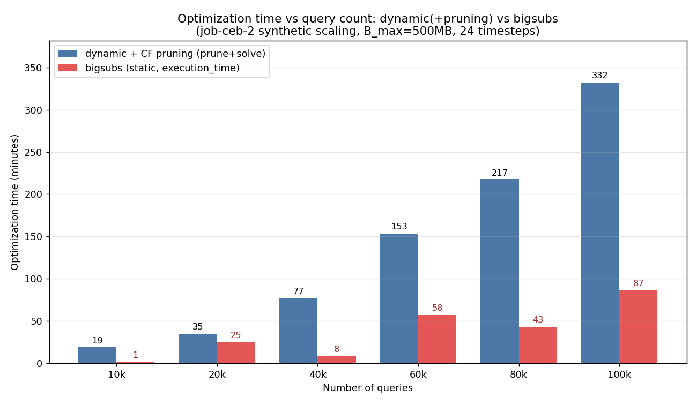

# dynamic(+pruning) vs bigsubs：最適化時間スケーラビリティ比較

計測日: 2026-06-21〜22
対象: `job-ceb-2` を擬似K倍タイル複製した合成クエリセット（最適化のみ・ベンチマークなし）
共通条件: `B_max=500MB`, 頻度 `_24_mono`（24タイムステップ）, Gurobi(アカデミック), 64コア/2TiB RAM

## 最適化時間の比較



- **dynamic + CF pruning**：プルーニング時間 ＋ ILP求解時間（正味）
- **bigsubs**：`execution_time`（反復ヒューリスティクスの実行時間）

## 結果テーブル

| クエリ数 | dynamic(+pruning) | bigsubs | bigsubs反復数 | 速度比(dyn/big) |
|---:|---:|---:|---:|---:|
| 10,000 | 18.9分 | 1.5分 | 22 | 12.8× |
| 20,000 | 35.1分 | 25.2分 | 200 | 1.4× |
| 40,000 | 77.3分 | 8.4分 | 29 | 9.1× |
| 60,000 | 153.4分 | 57.5分 | 153 | 2.7× |
| 80,000 | 217.2分 | 43.3分 | 118 | 5.0× |
| 100,000 | 331.9分 | 86.7分 | 182 | 3.8× |

（参考）選択MV数: dynamic は平均 3,589→15,019/タイムステップ、bigsubs は 2,343→5,194。

## 考察

- **bigsubs は全規模で dynamic より高速**（1.4〜12.8倍）。理由は2つ：
  1. dynamic の総時間は **CF Pruning が支配的**（全体の97%以上、本パイプライン最大のボトルネック）。bigsubs はプルーニングを行わず、全候補に対しランダムフリップ＋クエリ単位の微小ILPで進めるため、その重い前処理が無い。
  2. bigsubs は**単一の「平均」静的スナップショット**を解く（24タイムステップもマイグレーションコストも扱わない）。dynamic は24時点＋マイグレーションを含む時間依存ILPで、本質的に重い問題を解いている。
- **bigsubs の時間は非単調・ばらつきが大きい**（例：40k=8.4分 < 20k=25.2分）。実行時間が「反復数 × クエリ数」にほぼ比例し、反復数がランダム初期化と収束状況で 22〜200 と大きく変動するため。**bigsubs の計時は再実行ごとに変わりうる**点に注意（複数回平均が望ましい）。
- **dynamic の時間は滑らかに超線形増加**（プルーニング律速、≒N^1.3）。

## 重要な注意：両者は「別の問題」を解いている

この比較は**実行時間（スケーラビリティ）のみ**の比較であり、解の品質や目的関数値は直接比較できない。

| | dynamic + pruning | bigsubs |
|---|---|---|
| 問題 | 時間依存（24時点）＋マイグレーションコスト | 単一の平均静的スナップショット |
| 求解 | プルーニング後の候補に対する厳密ILP(Gurobi) | ランダム初期化＋反復ヒューリスティクス（近似） |
| マイグレーション | 考慮する | 考慮しない |

したがって目的関数値（dynamic は負の時間依存コスト、bigsubs は静的利得）は土俵が異なるため本比較には含めていない。「同一ワークロード規模で各手法の最適化がどれだけ時間を要するか」を見る趣旨。

## 再現方法

```bash
# dynamic + pruning
bash scripts/shell/run_scaling_pruning.sh          # （シェル内で optimization-mode dynamic --use-pruning）
# bigsubs（シェルの最適化指定を static/bigsubs にして実行）
# グラフ生成
.venv/bin/python progress/scaling_pruning/plot_compare.py
```
