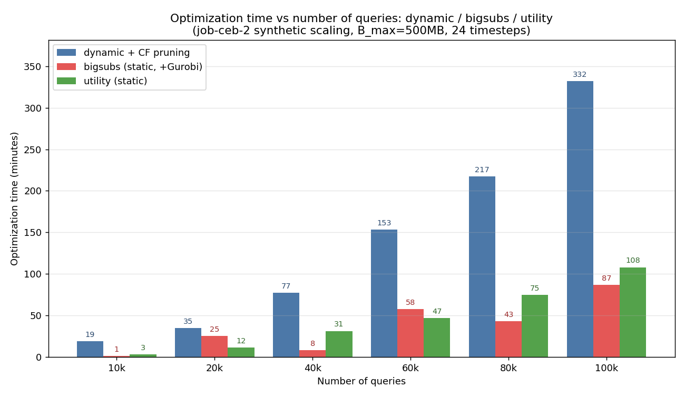
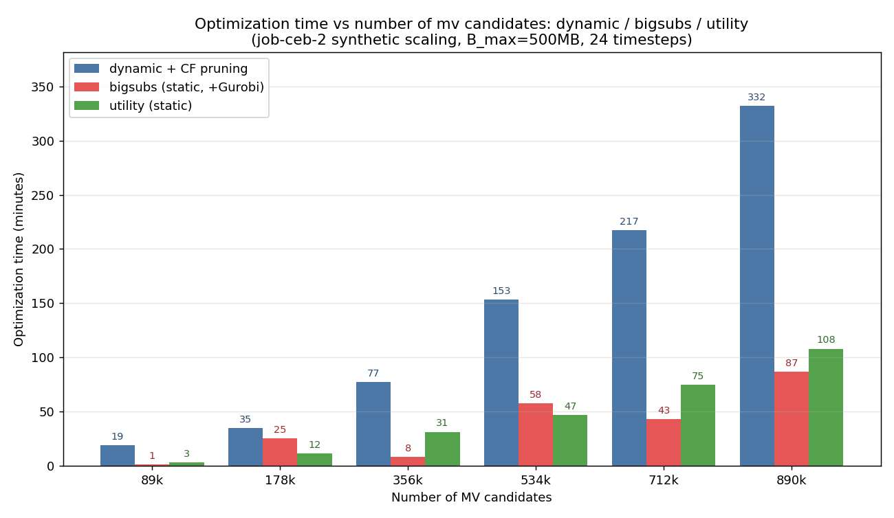

# 3手法の最適化時間スケーラビリティ比較（dynamic / bigsubs / utility）

計測日: 2026-06-21〜22
対象: `job-ceb-2` を擬似K倍タイル複製した合成クエリセット（最適化のみ・ベンチマークなし）
共通条件: `B_max=500MB`, 頻度 `_24_mono`（24タイムステップ）, Gurobi(アカデミック), 64コア/2TiB RAM

対象3手法:
- **dynamic + CF pruning**：時間依存(24時点)＋マイグレーション込みの厳密ILP（CFプルーニング後にGurobi求解）。時間＝プルーニング＋ILP求解。
- **bigsubs (static)**：平均スナップショットに対する反復ヒューリスティクス。時間＝`execution_time`。※局所ILPは**Gurobi版**（論文の自作B&B版ではない＝"BigSubs+Gurobi"相当）。
- **utility (static)**：貪欲初期化＋近傍探索＋候補ILP(Gurobi)のヒルクライミング。時間＝`execution_time`。

## グラフ①：横軸=クエリ数



## グラフ②：横軸=実体化ビュー候補数（利得>0のノード数）



クエリ数とMV候補数はほぼ比例（候補 ≈ クエリ×8.9）。候補数軸は BigSubs 論文（横軸が候補部分式数）との対応を見やすくするため。

## 結果テーブル

| クエリ数 | MV候補(利得>0) | dynamic | bigsubs | utility |
|---:|---:|---:|---:|---:|
| 10,000 | 89,909 | 18.9分 | 1.5分 | 3.1分 |
| 20,000 | 178,884 | 35.1分 | 25.2分 | 11.6分 |
| 40,000 | 356,702 | 77.3分 | 8.4分 | 31.4分 |
| 60,000 | 534,536 | 153.4分 | 57.5分 | 47.2分 |
| 80,000 | 712,370 | 217.2分 | 43.3分 | 75.0分 |
| 100,000 | 890,201 | 331.9分 | 86.7分 | 108.1分 |

（参考）選択MV数: dynamic は平均 3,589→15,019/タイムステップ、bigsubs 2,343→5,194、utility 3,934→16,313。

## 考察

- **dynamic が最も重く**、クエリ数に対し滑らかに超線形増加（≒N^1.3）。総時間の97%以上がCF Pruning。時間依存(24時点)＋マイグレーションという**最も難しい問題**を解いているため。
- **utility は単調増加**で中間的（3→108分）。貪欲初期化が候補を絞った上でのヒルクライミングのため、規模に対し素直に伸びる。
- **bigsubs は平均的には最速だが非単調・ばらつき大**（40k=8分 < 20k=25分）。実行時間が「反復数×クエリ数」に比例し、反復数がランダム初期化で 22〜200 と変動するため。**再実行で値が変わる**点に注意（複数回平均が望ましい）。
- 100kでは utility(108分) > bigsubs(87分) と逆転。utility は規模とともに着実に増えるのに対し、bigsubs はその回の反復数次第。

## 重要な注意：比較は「実行時間」のみ

3手法は解いている問題が異なるため、目的関数値の直接比較はしていない。
- dynamic：24時点＋マイグレーション込みの厳密最適化
- bigsubs / utility：単一の平均静的スナップショットの近似ヒューリスティクス（マイグレーション非考慮）

本比較は「同一ワークロード規模で各手法の最適化にどれだけ時間がかかるか（スケーラビリティ）」を見る趣旨。

補足：
- bigsubs の局所ILPは現状 **Gurobi版**（論文の主力である自作Branch-and-Bound版ではない）。論文では自作B&B版が"+Gurobi"版より約75%速いと報告されており、B&B版にすればbigsubsはさらに高速・安定化する見込み。
- bigsubs のばらつきが気になる場合、各規模を複数回実行して平均/エラーバーを取るとより堅牢。

## 再現方法

```bash
.venv/bin/python progress/scaling_pruning/plot_three.py
```
（各手法の結果JSONは `time_dependent_output/job-ceb-2-q{N}/` 配下：
dynamic=`td_mv_optimization_result_24_mono.json`,
bigsubs=`static_bigsubs_optimization_result_24_mono.json`,
utility=`static_mv_optimization_result_24_mono.json`）
