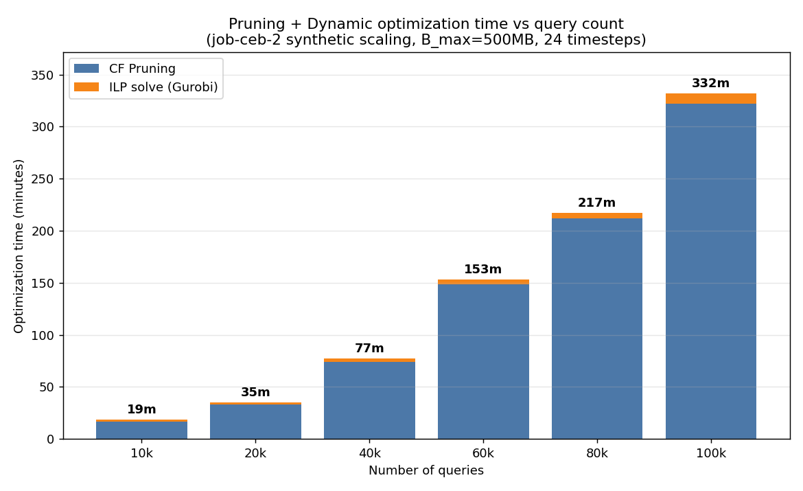

# pruning付き dynamic 最適化のスケーラビリティ計測結果

計測日: 2026-06-21〜22
対象: `job-ceb-2` を擬似的にK倍タイル複製した合成クエリセット（最適化のみ・ベンチマークなし）
条件: `--optimization-mode dynamic --use-pruning`, `B_max=500MB`, 頻度 `_24_mono`（24タイムステップ）, Gurobi(アカデミック), マシン 64コア/2TiB RAM

## 最適化時間 vs クエリ数



棒は「**CF Pruning 時間**」＋「**ILP求解時間(Gurobi)**」の積み上げ（＝最適化の正味時間）。各棒上の数値は合計（分）。

## 結果テーブル

| クエリ数 | ノード数 J | 候補(利得>0) | 有望MV | 削減率 | プルーニング | ILP求解 | 最適化計 |
|---:|---:|---:|---:|---:|---:|---:|---:|
| 10,000 | 100,595 | 89,909 | 4,944 | 95.1% | 16.6分 (994s) | 2.3分 (137s) | **18.9分** |
| 20,000 | 199,639 | 178,884 | 8,473 | 95.8% | 33.0分 (1,980s) | 2.1分 (126s) | **35.1分** |
| 40,000 | 397,727 | 356,702 | 14,242 | 96.4% | 74.3分 (4,458s) | 3.0分 (178s) | **77.3分** |
| 60,000 | 595,815 | 534,536 | 17,753 | 97.0% | 148.4分 (8,903s) | 5.0分 (300s) | **153.4分** |
| 80,000 | 793,903 | 712,370 | 20,811 | 97.4% | 211.8分 (12,709s) | 5.4分 (325s) | **217.2分** |
| 100,000 | 991,991 | 890,201 | 22,498 | 97.7% | 321.9分 (19,312s) | 10.1分 (604s) | **331.9分** |

※「最適化計」はプルーニング＋ILP求解の正味時間。pickle読み込み等のI/O（数十秒〜数分）は含まない。

## 考察

- **プルーニングが支配的**（全体の97〜99%）。ILP求解はどの規模でも数分に収まる。
- **プルーニング時間は超線形**：クエリ10倍（10k→100k）でプルーニング時間は約19.4倍（≒ N^1.3）。WST各ノードの局所ILPが候補数（≒J、クエリ数に線形）に依存するため。
- **ILP求解は緩やか**（10k→100kで137s→604s、約4.4倍＝N^0.64の準線形）。これは**プルーニングが有望MVを強力に絞る**ため：有望MVはクエリ10倍でも4,944→22,498（約4.5倍）しか増えず、最終ILPが小さく保たれる。
- **削減率は規模とともに上昇**（95.1%→97.7%）。クエリが増えるほど冗長な候補が増え、プルーニングがより効く。
- 結論：このパイプラインの**スケーラビリティのボトルネックはCF Pruning**であり、ILPソルバ自体ではない。大規模化では並列プルーニング（`--pruning-parallel`）等の高速化が有効と考えられる。

## 計測上の注意

- グラフ/テーブルの時間は **プルーニング時間＋ILP求解時間**（全規模で一貫して計測できる正味値）を用いた。
- 結果JSONの `phase_time_sec`（総フェーズ時間）は、10k/20k は `y_by_timestep` のOOM修正**前**に実行されたため、廃棄される密配列（T×I×J）の確保時間が混入しており、40k以降（修正後）と直接比較できない。そのため上記の正味値を採用している。

## 再現方法

```bash
# セット生成（一度だけ）
.venv/bin/python scripts/extract_sparse_base.py --query-set job-ceb-2
for N in 10000 20000 40000 60000 80000 100000; do
  .venv/bin/python scripts/generate_synthetic_scaling.py --base-set job-ceb-2 --queries $N --freq-suffix _24_mono
done
# 実行
bash scripts/shell/run_scaling_pruning.sh
# グラフ生成
.venv/bin/python progress/scaling_pruning/plot_scaling.py
```
