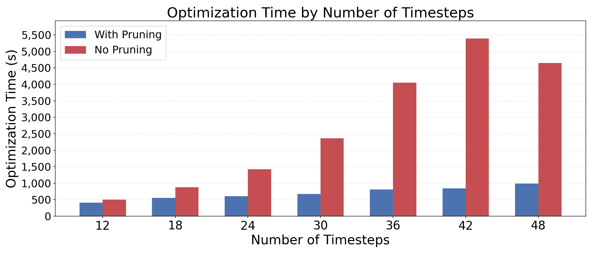

# 最適化時間のスケーラビリティ評価（タイムステップ数を増加させた場合）

作成日: 2026-07-13

## 概要

クエリセット `job-ceb-2`（2,500 クエリ）を固定し、**タイムステップ数**を 12〜48 まで 6 刻みで
増加させたときの**最適化フェーズ（Phase 6）の実行時間**を、CF プルーニングの有無で比較した。

| 系列 | 説明 | 結果ファイル |
|---|---|---|
| **With Pruning** | 提案手法（時間依存 dynamic）＋ CF Pruning（並列） | `..._{TS}_mono_wp.json` |
| **No Pruning** | 提案手法だが CF Pruning なし（全候補を ILP に投入） | `..._{TS}_mono_wo.json` |

データフォルダ: `time_dependent_output/job-ceb-2/result_scaling_time_ok/`

最適化時間は各結果の `phase_time_sec`（Phase 6 全体の実時間）を使用。
With Pruning はプルーニング時間 + ILP 求解時間 + 付随処理、No Pruning は ILP 求解時間 + 付随処理。
候補 MV 総数はクエリセットが同一のため全タイムステップで一定（約 26,312）で、
ここでは**タイムステップ数のみ**を変化させている。

## 結果

PDF 版: [timestep_bar.pdf](timestep_bar.pdf)
生成スクリプト: [plot_timestep.py](plot_timestep.py) / 数値: [timestep.json](timestep.json)

縦軸は全バーが収まるよう自動で引き伸ばしている（具体値は下表を参照）。

### 数値（最適化時間 phase_time_sec, 単位: 秒）

| タイムステップ | With Pruning | No Pruning | 比 (No/With) |
|---:|---:|---:|---:|
| 12 | 413.3 | 505.5 | 1.2× |
| 18 | 550.8 | 876.9 | 1.6× |
| 24 | 606.6 | 1,427.7 | 2.4× |
| 30 | 677.8 | 2,364.8 | 3.5× |
| 36 | 814.3 | 4,053.9 | 5.0× |
| 42 | 848.2 | 5,388.5 | 6.4× |
| 48 | 991.5 | 4,645.4 | 4.7× |

### With Pruning の内訳（単位: 秒）

| タイムステップ | プルーニング | ILP 求解 | 合計 (phase) |
|---:|---:|---:|---:|
| 12 | 372.1 | 3.3 | 413.3 |
| 24 | 529.5 | 9.9 | 606.6 |
| 36 | 713.2 | 12.7 | 814.3 |
| 48 | 839.2 | 51.7 | 991.5 |

## 考察

- **With Pruning はタイムステップ数に対して緩やかに増加。** 12→48 タイムステップ（4 倍）で
  413→992 秒（約 2.4 倍）に留まり、全域で 1,000 秒未満。内訳を見ると大半はプルーニング時間で、
  ILP 求解自体は 48 タイムステップでも 51.7 秒と軽い。
- **No Pruning はタイムステップ数の増加とともに急激に悪化。** 24 タイムステップで既に 1,000 秒を超え、
  42 タイムステップでは 5,389 秒に達する。タイムステップを増やすと ILP に「候補 MV × タイムステップ」分の
  バイナリ変数とマイグメント結合制約が層状に増えるため、全候補（約 26,312）を投入する No Pruning では
  問題規模が急拡大する。
- **プルーニングの効果はタイムステップ数が多いほど拡大。** No/With 比は 12 タイムステップの 1.2 倍から
  42 タイムステップの 6.4 倍まで広がる。タイムステップ方向のスケールでも、CF Pruning が
  候補集合を小さく保つことで最適化を実用時間に収める役割を果たしている。
- 48 タイムステップの No Pruning が 42 タイムステップより小さい（4,645 < 5,389）のは、
  ILP ソルバの探索過程による変動（求解が偶々早く収束）と考えられ、傾向自体は単調増加である。

## まとめ

タイムステップ数を増やすと、プルーニングなしの最適化時間は急激に増大（24 以上で 1,000 秒超、
最大 5,389 秒）する一方、CF Pruning ありでは全域で 1,000 秒未満に抑えられる。
クエリ数方向だけでなく**タイムステップ数方向のスケーラビリティ**においても、CF Pruning は
提案手法を実用時間で解くための不可欠な構成要素であることが確認できた。

## 備考

- 最適化時間 = `phase_time_sec`（Phase 6 全体）。With Pruning はプルーニング + ILP 求解 + 付随処理、
  No Pruning は ILP 求解 + 付随処理。
- クエリセットは `job-ceb-2`（2,500 クエリ）、頻度パターンは monotonic（`_mono`）で固定。
- 配色・体裁は参考の棒グラフ（`plot_timestep.py`）に準拠。y 軸は全バーが収まるよう自動で
  引き伸ばし（具体値は本文の表を参照）。
